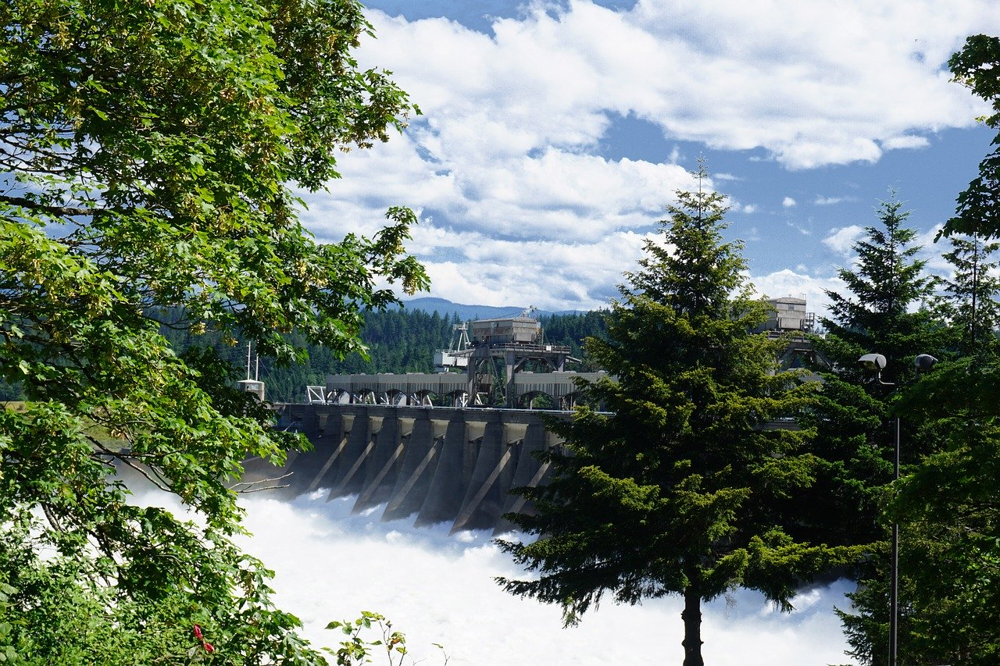

```{r setup, include=FALSE}
knitr::opts_chunk$set(echo = TRUE,
                      warning = FALSE,
                      message = FALSE)
```


The Bonneville Dam, constructed in the 1930s, is located along the Columbia River between Washington state and Oregon (Figure 1). The construction of this dam was environmentally controversial, as it was predicted to impede fish migration. This project explores potential trends in steelhead salmon passage across the Bonneville Dam in Oregon from 1940 to 2019. The purpose of this examination is to determine if there are any visually distinguishable patterns in steelhead salmon passage over this time period. Overall, the monthly passage of steelhead salmon across the dam increased from 1940 to 2019 (Figure 3). However, yearly passage of steelhead salmon has been decreasing in the past decade (Figure 4). 


```{r}

# Include a photo of the Bonneville Dam



```
**Figure 1. Bonneville Dam, Oregon.** Photo source: Pixabay. 

#### 1. Load necessary packages.
```{r}

library(tidyverse)
library(janitor)
library(kableExtra)
library(naniar)
library(skimr)
library(sf)
library(tmap)
library(paletteer)
library(lubridate)

# For ts stuff: 
library(tsibble)
library(fable)
library(fabletools)
library(feasts)
library(forecast)

```

#### 2. Read in the data and wrangle: steelhead salmon passage across the Bonneville Dam (Oregon) from 1940 - 2019.
```{r}

salmon <- read_csv("cbr_fish_passage_bonneville_allyrs_steelhead.csv") %>% 
  clean_names() %>% 
  mutate(date = paste(year, mm_dd, sep = "-")) %>% # Combining year and month&day columns into one column
  mutate(date_new = lubridate::parse_date_time(date, "ydm")) # Converting date column into a recognized date column

# Look for NAs

gg_miss_var(salmon)

# Remove NAs and wrangle data

salmon_clean <- salmon %>% 
  drop_na(value, date_new) %>% 
  mutate(date_final = date_new) %>% 
  separate(date_final, sep = "-", into = c("year", "month", "day")) %>% # Separating year, month, and day to calculate summary statistics below
  select(year, month, day, date_new, value) %>% 
  mutate(year = as.numeric(year), 
         month = as.numeric(month),
         day = as.numeric(day)) # Year, month, and day columns were in character format, so converting to numeric for graphing purposes
  
```

```{r}

# Create data frame with monthly counts of salmon

salmon_monthly <- salmon_clean %>% 
  group_by(year, month) %>% 
  summarize(monthly_salmon = sum(value)) 


# Create data frame with yearly counts of salmon

salmon_yearly <- salmon_clean %>% 
  group_by(year) %>% 
  summarize(yearly_salmon = sum(value))

```

#### 3. Create time series plots for daily, monthly, and yearly salmon counts. 
```{r}

# Plot daily salmon counts

daily_salmon_plot <- ggplot(salmon_clean, aes(x = date_new, y = value)) +
  geom_line(color = "darkblue") +
  theme_classic() +
  labs(x = "\nYear",
       y = "Daily Adult Salmon Count\n") +
  ggtitle("Daily Steelhead Salmon Passage at Bonneville Dam (1940 - 2019)") +
  theme(plot.title = element_text(hjust = 0.5)) +
  scale_y_continuous(expand = c(0,0),
                     labels = scales::comma)
  
daily_salmon_plot

```

**Figure 2. Daily counts of adult steelhead salmon passage across the Bonneville Dam from 1940 to 2019.** The largest daily count of steelhead passage occurred on August 13, 2009 and totaled 34,053 recorded fish. Data source: Columbia River DART, Columbia Basin Research, University of Washington.

```{r}

# Plot monthly salmon counts and group by year to determine if monthly salmon counts have changed throughout time

monthly_salmon_plot <- ggplot(salmon_monthly, aes(x = month, y = monthly_salmon, group = year)) +
  geom_line(aes(color = year)) +
  theme_classic() +
  scale_x_continuous(breaks = c(1, 2, 3, 4, 5, 6, 7, 8, 9, 10, 11, 12)) +
  labs(x = "\nMonth",
       y = "Monthly Adult Salmon Count\n",
       color = "Year") +
  ggtitle("Monthly Steelhead Salmon Passage at Bonneville Dam (1940 - 2019)") +
  theme(plot.title = element_text(hjust = 0.5)) +
  scale_y_continuous(expand = c(0,0),
                     labels = scales::comma)

monthly_salmon_plot

```

**Figure 3. Monthly counts of adult steelhead salmon passage across the Bonneville Dam from 1940 to 2019.** From 1940 to 2019, the count of monthly adult salmon generally increased. This observation is especially evident for the month of August. Data source: Columbia River DART, Columbia Basin Research, University of Washington.

```{r}

# Plot annual salmon counts to determine if yearly salmon counts have changed from 1940 to 2019

annual_salmon_plot <- ggplot(salmon_yearly, aes(x = year, y = yearly_salmon)) +
  geom_line(color = "darkgreen") +
  theme_classic() +
  labs(x = "\nYear",
       y = "Annual Adult Salmon Count\n") +
  ggtitle("Annual Steelhead Salmon Passage at Bonneville Dam (1940 - 2019)") +
  theme(plot.title = element_text(hjust = 0.5)) +
  scale_y_continuous(expand = c(0,0),
                     labels = scales::comma)

annual_salmon_plot

```

**Figure 4. Annual counts of adult steelhead salmon passage across the Bonneville Dam from 1940 to 2019.** Annual counts of steelhead salmon increased from the 1990s to the early 2000s. There is a dip in annual salmon count around 2005 and subsequent increase in count around 2010, but annual salmon counts overall decreased from 2010 to 2019. Data source: Columbia River DART, Columbia Basin Research, University of Washington.

